# SwitchingPlatformsUsedBooks
二手书盲换平台 亮点：AI换书助手、WebSocket实时沟通、支付宝沙盒支付、Echarts分析、协同过滤算法推荐、二手书交易与盲换融合、双向意愿匹配、信誉与纠纷管理、完整交易闭环；

# 二手书盲换平台

> 基于 Spring Boot 3 + Vue 3 的二手书交易平台，把「买书」和「换书」放在同一套流程里，并加入盲换匹配、AI 换书助手与纠纷处理机制。

**系统亮点**：AI换书助手 · WebSocket实时沟通 · Echarts分析 · 协同过滤智能推荐 · 支付宝沙箱支付 · 二手书交易与盲换融合 · 双向意愿匹配 · 信誉与纠纷管理 · 完整交易链路

## 一、项目简介

家里的书读完就吃灰，卖掉嫌麻烦、留着占地方——二手书盲换平台就从这个念头出发，把闲置书籍的两种出路合到一起：既能直接挂价卖，也能和别人换着看。

除了常规的交易流程，平台还做了「盲换」：系统根据你的阅读兴趣标签和收藏、评论、下单行为，用协同过滤算法找出兴趣相近的用户，把他们的书推给你；你对推送的书标记「想要」或「不想要」，双方互相想要才能发起交换，换书这件事因此多了点探索的乐趣。交易过程中出现书况争议，可以发起纠纷由管理员介入，配合信誉分机制约束恶意行为。

## 二、技术架构

| 类别 | 说明 |
| :--- | :--- |
| 架构 | B/S、MVC、前后端分离、用户网页端+管理后台、管理员与普通用户角色权限管理 |
| 系统环境 | Windows |
| 开发环境 | IDEA、JDK17、Maven、MySQL、Node.js |
| 后端技术 | Java、Spring Boot 3、Spring MVC、MyBatis-Plus、MySQL、JWT、WebSocket、HanLP中文分词 |
| 前端技术 | Vue 3、Vite、Element Plus、Vue Router、Pinia、Axios、ECharts、ECharts词云 |
| 特色集成 | DeepSeek AI换书助手、协同过滤推荐、支付宝沙箱支付 |

系统采用 B/S 架构与 MVC 分层，前后端分离；用户网页端加管理后台双端并行，按管理员与普通用户划分权限。

## 三、系统亮点

- **AI换书助手**：接入 DeepSeek，结合用户兴趣与书籍信息提供阅读推荐和交换建议，支持流式回复与历史会话管理。
- **WebSocket实时沟通**：通过 WebSocket 实现用户在线聊天，方便交易双方交流书籍成色、交换意向及配送安排。
- **Echarts分析**：后台支持书籍、交易、盲换池和纠纷等多维统计，帮助管理员掌握平台运营情况。
- **协同过滤智能推荐**：根据用户收藏、评论和下单行为，利用余弦相似度识别兴趣相近的用户，为用户推荐可能感兴趣的盲换书籍。
- **支付宝沙箱支付**：支持二手书购买订单在线模拟支付、支付状态查询与订单状态自动更新，形成完整的购买支付流程。
- **二手书交易与盲换融合**：支持书籍购买、主动换书和盲换匹配，满足闲置书籍流转与阅读交流需求。
- **双向意愿匹配**：通过“想要／不想要”记录换书意向，双方互相想要后可发起交换，让换书更具探索感。
- **信誉与纠纷管理**：提供信誉分、变动记录、交易评价和纠纷处理，并对低信誉用户限制交易，辅助平台维护交易秩序。
- **完整交易链路**：覆盖书籍发布、交易申请、订单确认、物流记录、收货和评价，购买流程接入支付宝沙箱支付，便于演示。

## 四、界面展示

以下截图均存放于仓库 `images/` 目录，不依赖外部图床。

### 4.1 系统总览

**图 01 · 系统总览**：系统整体功能与模块全景。

### 4.2 用户端

面向普通读者，覆盖「逛书 → 上架自己的书 → 盲换匹配 → 在线沟通 → 下单交换 → 处理纠纷」的整个流程。

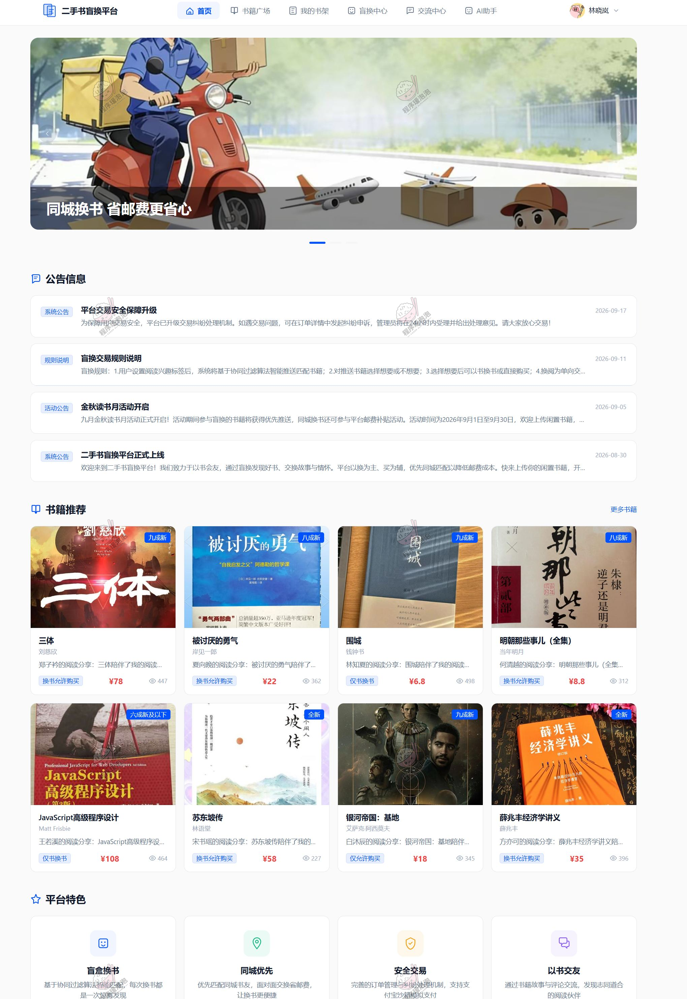

**图 02 · 首页**：首页展示公告、平台特色与书籍推荐位，支持按兴趣浏览。

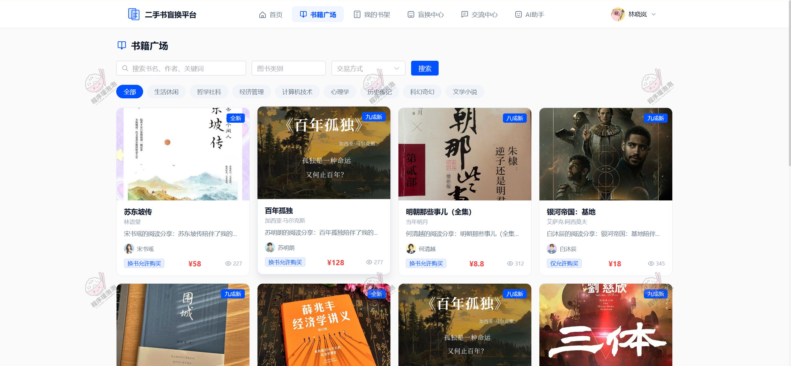

**图 03 · 书籍广场**：书籍广场按图书类别与交易方式筛选，支持书名、作者、关键词搜索。

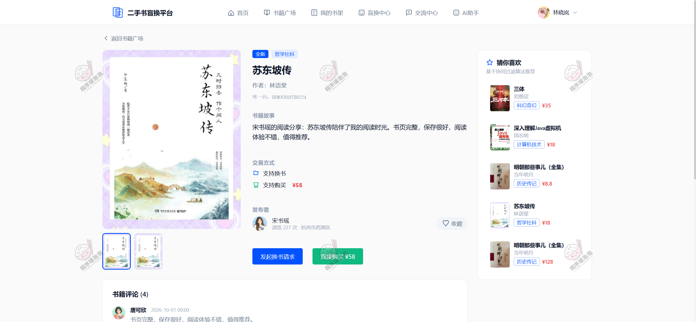

**图 04 · 书籍详情**：书籍详情页含书籍故事、成色、交易方式与协同过滤推荐位。

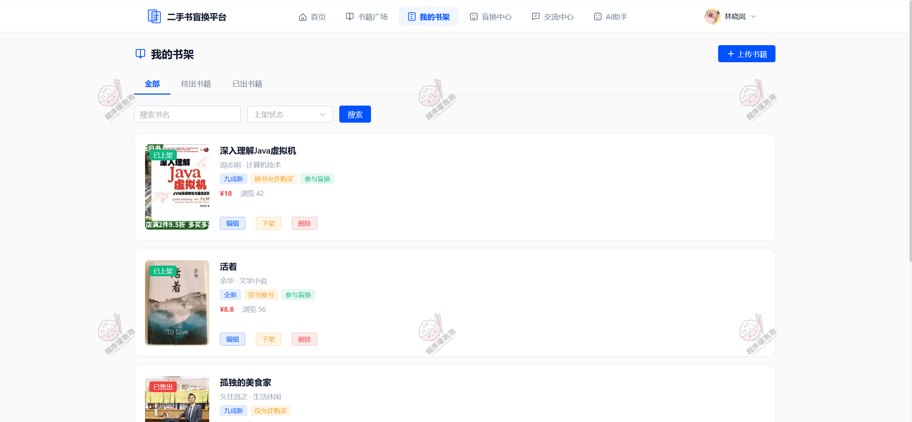

**图 05 · 我的书架**：我的书架管理已出与待出书籍，支持上架、下架与编辑。

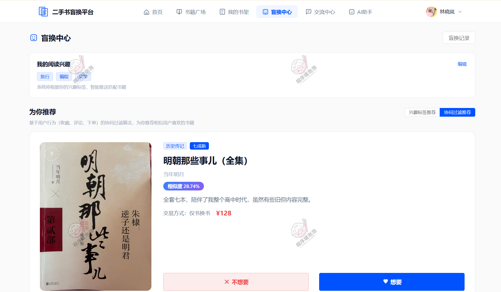

**图 06 · 盲换中心**：盲换中心按兴趣标签与协同过滤算法推送书籍，可标记「想要／不想要」。

**图 07 · 交流中心**：交流中心基于 WebSocket 的实时会话，方便换书双方沟通细节。

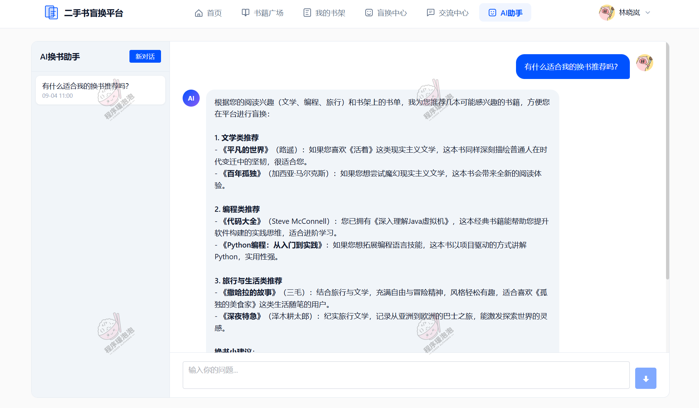

**图 08 · AI助手**：AI 换书助手结合阅读兴趣与书架书单给出换书建议，支持流式回复。

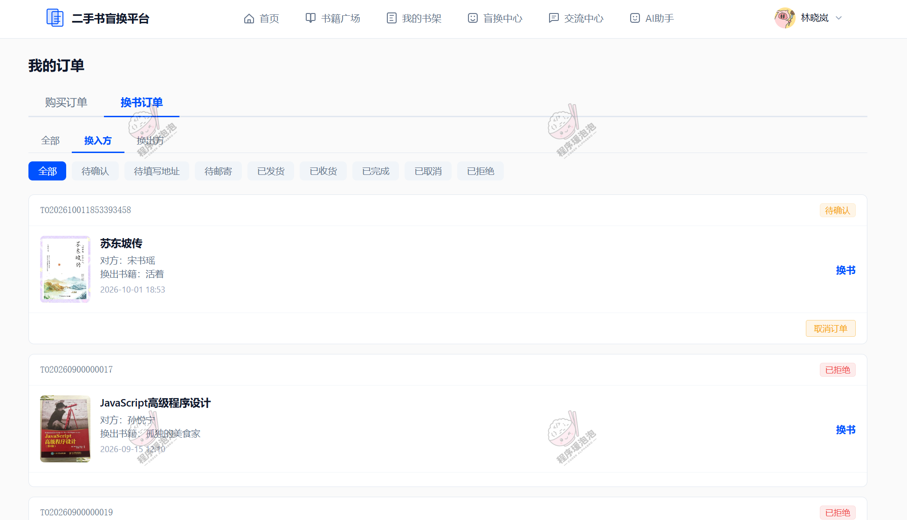

**图 09 · 换书订单**：换书订单区分换入方与换出方，跟踪待确认、待邮寄到已完成等状态。

**图 10 · 换书纠纷**：换书纠纷由用户发起，填写关联订单与纠纷原因等待平台处理。

### 4.3 管理员端

面向平台运营方，负责书籍与评论内容、交易订单、物流、纠纷和盲换匹配记录的统一维护，并通过数据看板掌握平台运营情况。

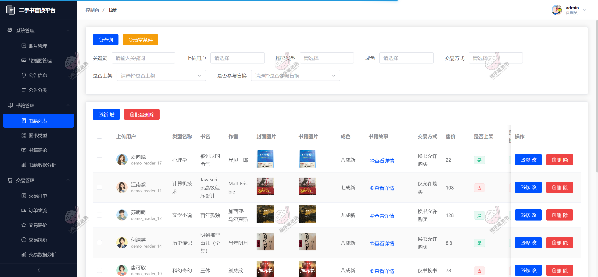

**图 11 · 书籍列表**：书籍列表维护平台书籍，含类型、交易方式、成色与上架状态。

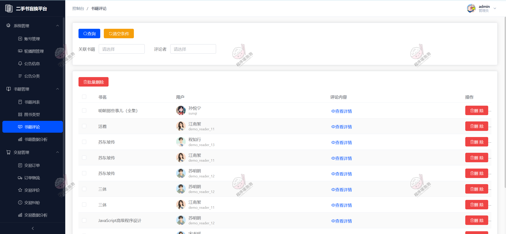

**图 12 · 书籍评论**：书籍评论管理，查看评论内容与关联书籍并可做删除处理。

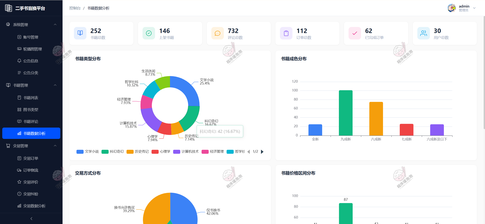

**图 13 · 数据分析**：数据分析看板统计用户、书籍、评论与订单，并展示成色、类型、价格分布。

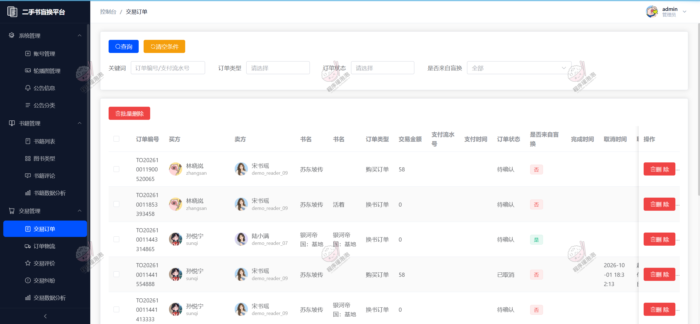

**图 14 · 交易订单**：交易订单管理购买与换书订单，跟踪支付流水与订单状态。

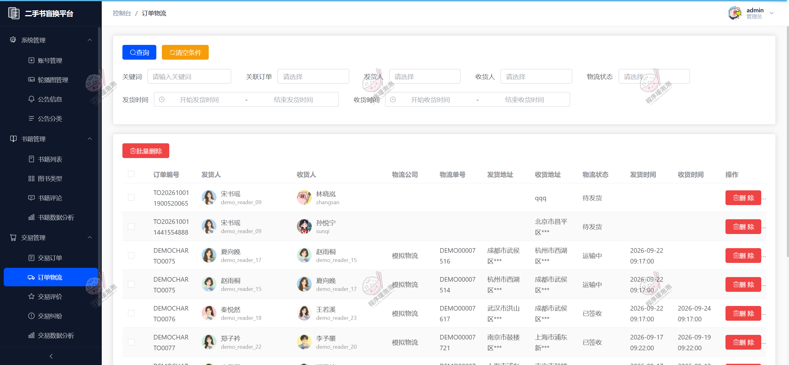

**图 15 · 订单物流**：订单物流记录发货收货信息、物流公司与单号，模拟物流状态流转。

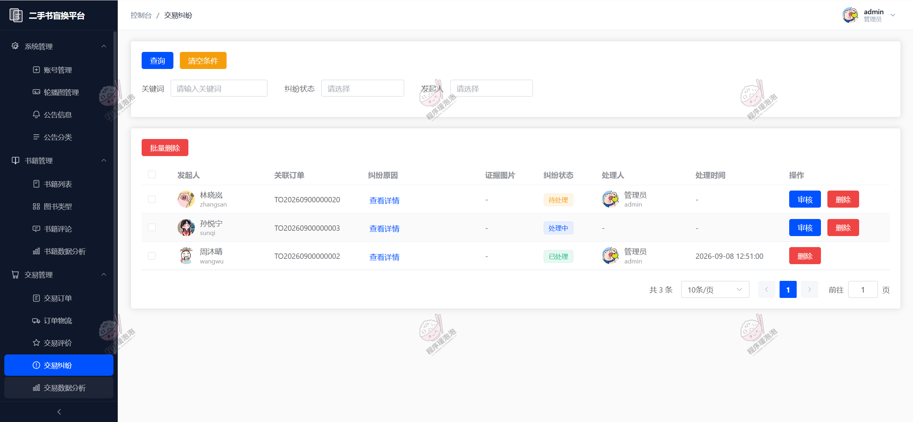

**图 16 · 交易纠纷**：交易纠纷由管理员审核处理，记录纠纷原因、证据图片与处理时间。

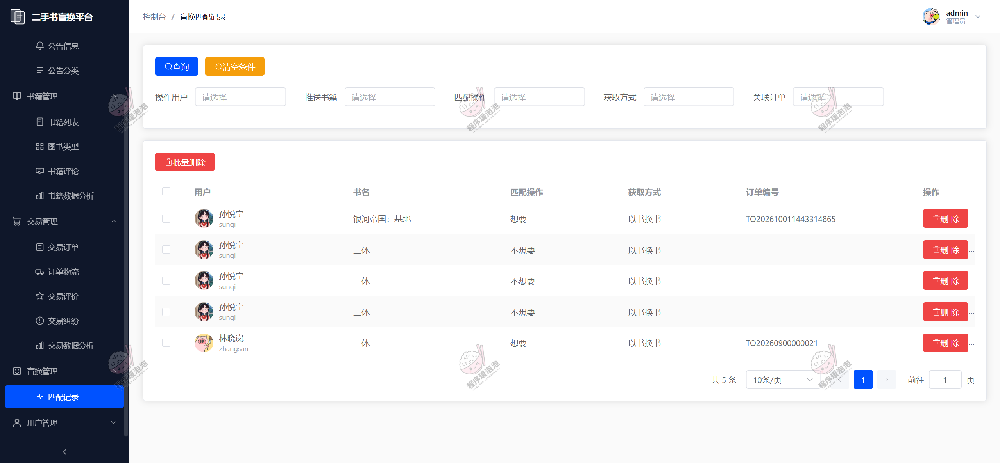

**图 17 · 匹配记录**：盲换匹配记录查看每位用户对推送书籍的「想要／不想要」意向。

## 五、说明

- 本文所展示的系统界面与数据均为演示环境下的测试内容，仅用于说明系统功能与设计思路。
- **本项目仅用于学习交流，非商用、非开源、非无偿。**
- 文档展示 17 张截图，需要了解更多，请联系我。

